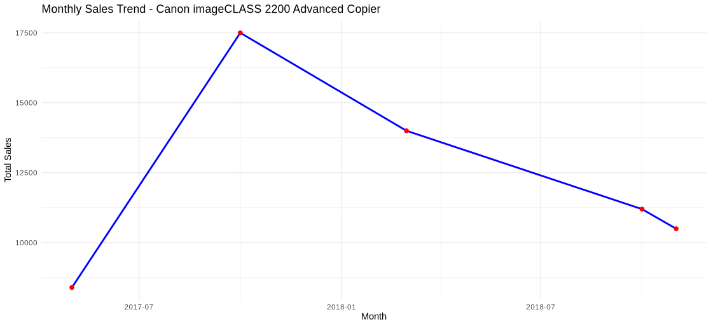
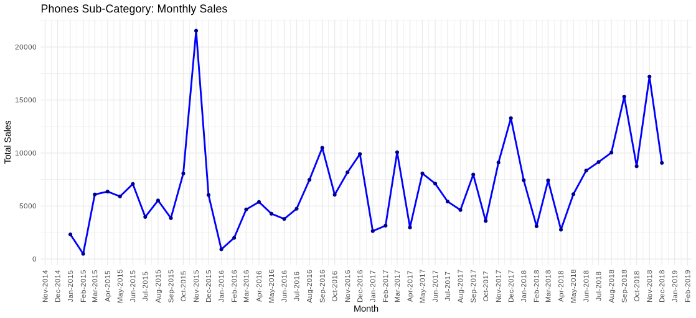
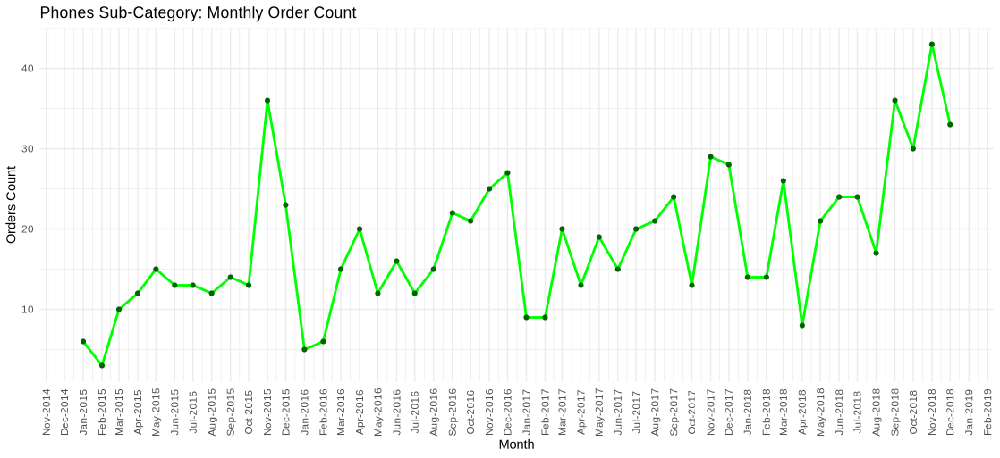
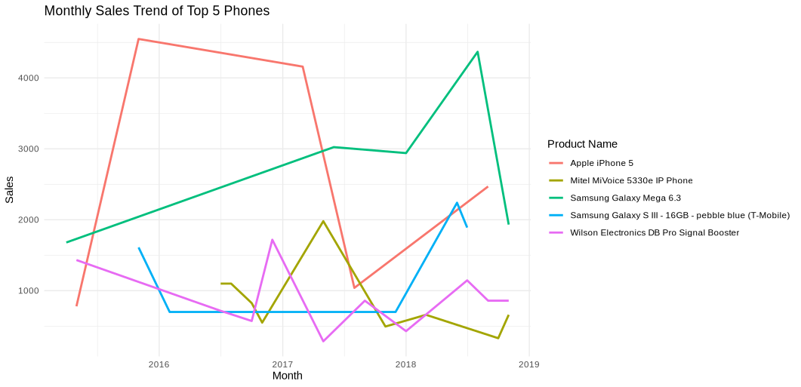

# Superstore Sales and Customer Analysis  

**A Data-Driven Look at Revenue, Products, and Customer Segments for Smarter Business Decisions**  

Retailers collect abundant of sales data every year, but turning that data into *actionable insights* is where the real value lies.  

In this project, I analyzed the **Superstore Sales Dataset** from [Kaggle](https://www.kaggle.com/datasets/rohitsahoo/sales-forecasting) to uncover:  

- How revenue changes over time (and when peak sales occur)  
- Which products and categories drive the most value  
- How customer segments differ in their buying behavior  
- Who the **VIP customers** are, and who is at risk of churn  
- What inventory managers should prepare for seasonal demand spikes  

The analysis combines three perspectives:  
- **SQL (BigQuery):** Cleaning and aggregating raw transactions into usable metrics  
- **Tableau Public:** Building interactive dashboards for revenue, product, and regional performance  
- **R (tidyverse):** Deep-diving into product trends and customer segmentation  

Together, these tools helped transform transactional data into clear business recommendations, like **when to stock up on phones before Black Friday** or **how to retain high-value customers with loyalty programs**.  

---

## Table of Contents
- [Project Objectives](#project-objectives)
- [Project Steps](#project-steps)
  - [SQL Data Processing](#1-sql-data-processing-bigquery)
  - [Tableau Public](#2-tableau-public)
  - [R Analysis](#3-r-analysis)
- [Key Findings](#key-findings)
- [Conclusion](#conclusion)
- [Reference & Acknowledgement](#reference--acknowledgement)
- [License](#license)

---

## Project Objectives

The goal of this project is to transform raw transactional data into meaningful business insights. Specifically, we aimed to:

- Analyze revenue trends over time, both monthly and yearly
- Identify top-performing products, categories, and regions
- Understand customer behavior through segmentation
- Highlight potential VIPs and at-risk customers for targeted campaigns
- Provide visual insights to support strategic decisions in sales and marketing

Achieving these objectives enables businesses to make informed decisions on inventory planning, marketing strategies, and customer engagement initiatives.

---

## Project Steps

### 1. SQL Data Processing (BigQuery)

SQL was used to clean, preprocess, and aggregate the raw sales data. This involved calculating monthly and yearly sales trends, identifying top and bottom products, and summarizing sales by category, segment, region, and top states.  

By preparing these datasets in SQL, we minimized the complexity in Tableau and R, allowing for smoother visualization and analysis.  

Key SQL outputs include:  
- **superstore_monthly.csv & superstore_monthly.sql** → Monthly sales trends  
- **superstore_yearly.csv & superstore_yearly.sql** → Yearly sales trends  
- **superstore_top_products.csv & .sql** → Top 10 products  
- **superstore_top_costumer.csv & .sql** → Top 10 customers  
- **superstore_category.csv & .sql** → Category and sub-category sales  
- **superstore_region.csv & .sql** → Regional sales  
- **superstore_segment.csv & .sql** → Segment-wise sales  
- **superstore_states.csv & .sql** → Top 10 states by sales  

These clean datasets were then saved as CSVs for direct use in Tableau and R.

---

### 2. Tableau Public

Tableau Public was used to create interactive dashboards for visual exploration and insights. The dashboards provide an overview of revenue trends, product performance, and regional and segment-based sales. 
The dashboard can be accessed [here](https://public.tableau.com/shared/FKBK62RR5?:display_count=n&:origin=viz_share_link).

#### Dashboard 1: Revenue Trends and Best-Selling Products

The **monthly sales trends** show an overall increasing pattern, though mixed with short-term downward fluctuations. Noticeable spikes occur between **September and January**, likely driven by holiday seasons and promotional campaigns.  

The **best-selling products** chart shows that the **Canon imageCLASS 2200 Advanced Copier** is the top product for **Consumer** and **Corporate** segments, while the **Cisco TelePresence System EX90 Videoconferencing Unit** dominates **Home Office** sales. This insight is crucial for inventory planning, ensuring top products are always well-stocked.  

Regarding **categories and subcategories**, the top performers are:  
1. Phones (Technology)  
2. Chairs (Furniture)  
3. Storage (Office Supplies)  

Inventory for these categories is relatively balanced, but attention should focus on the Canon copier due to its outsized contribution to revenue.

#### Dashboard 2: Regional and Customer Segment Performance

This dashboard highlights **regional and segment-based performance**. California leads in sales, followed by New York and Texas. These high-performing regions could benefit from targeted marketing and inventory optimization.  

Segment-wise, **Consumer** customers make up more than half of total sales, followed by **Home Office**, then **Corporate**. This aligns with the top products by segment, indicating that understanding segment-specific preferences is essential for promotions and product planning.

---

### 3. R Analysis

R was used to perform **detailed customer segmentation and product analysis**. Using the prepared datasets, we explored which products are most popular within each segment and which customers could be prioritized for targeted campaigns.

#### Top Products by Segment

This stacked bar chart shows total sales for top products across each segment. The **Canon imageCLASS 2200 Advanced Copier** is the most bought for both Consumer and Corporate segment while the **Cisco TelePresence System EX90 Videoconferencing Unit** is only bought from Home Office category which makes sense as home office would need video conferencing unit for online meeting purposes.  

However, is Canon imageCLASS 2200 Advanced Copier often bought monthly? By using R, we can analyze the monthly trend for this item:

From the trend above, this item is only bought 5 times throughout 2017 to 2019, which means we did not need to increase inventory for this particular item. Then, what the inventory should focus on? From the best category / sub-category dashboard, *Phones* sub-category is the most bought item. Let’s visualize:

  

From these two visualizations, **phones are steadily increasing**, with noticeable sales spikes every **November**, which likely correlates with seasonal events in the US such as **Black Friday** and **Cyber Monday**. This suggests that inventory for phones should be increased leading into Q4 each year.

But which phones are driving this growth? To answer this, we looked at the top 5 most purchased phone products:

Interestingly, while the *Phones* subcategory overall shows an upward trend, **individual phone models do not maintain consistent growth**. Most models sell strongly in certain years but then decline, likely due to **product lifecycle dynamics** (new models replacing old ones, tech obsolescence, changing preferences).  

**Key Insight:**  
- Inventory strategies should focus on **maintaining a broad and refreshed selection of phones**, rather than overstocking one or two "star" models.  
- Demand is steady at the subcategory level, but shifts quickly at the product level.  
- Businesses should plan for **shorter product lifespans**, anticipate **seasonal spikes**, and rotate stock frequently to align with customer preferences.  

#### Customer Spending vs Frequency

The scatter plot visualizes customer behavior with **monetary value on the X-axis** and **purchase frequency on the Y-axis**. Using color-coded points:  
- **Yellow (VIP):** High-spending, frequent buyers – ideal candidates for **loyalty programs** or **free delivery promotions**.  
- **Red (Re-engage):** Low-spending or declining frequency – targeted with **reactivation campaigns**.  
- **Blue (Other):** Moderate spenders and frequency – can receive **general offers or coupons**.  

This visualization allows marketing teams to **segment customers for personalized campaigns** efficiently.

---

## Key Findings

- **Revenue Trends:** Monthly sales are generally increasing, with spikes between **September and January** each year.  
- **Top Products & Categories:** Canon imageCLASS 2200 Advanced Copier drives major sales for **Consumer** and **Corporate** segments. Phones, Chairs, and Storage categories are strong performers.  
- **Customer Segmentation:** **Consumer** segment dominates, followed by **Home Office** and **Corporate**, correlating with top products.  
- **Regional Performance:** **California**, **New York**, and **Texas** are top revenue contributors.  
- **Customer Targeting:** VIPs (high frequency and spending) can benefit from loyalty perks, while at-risk customers should receive re-engagement campaigns.  

---

## Conclusion

By integrating **SQL**, **Tableau**, and **R**, this project provides an **inclusive view of Superstore sales and customer behavior**. Insights from this analysis inform **inventory management, marketing strategies, and customer retention programs**, enabling businesses to make data-driven decisions that optimize revenue and engagement.

---

## Reference & Acknowledgement

Thanks to the people behind the Superstore Sales Dataset, Rohit Sahoo, that makes this dataset available publicly and make this analysis possible.

---

## License

This project is licensed under the MIT License — see [LICENSE](LICENSE) for details.
